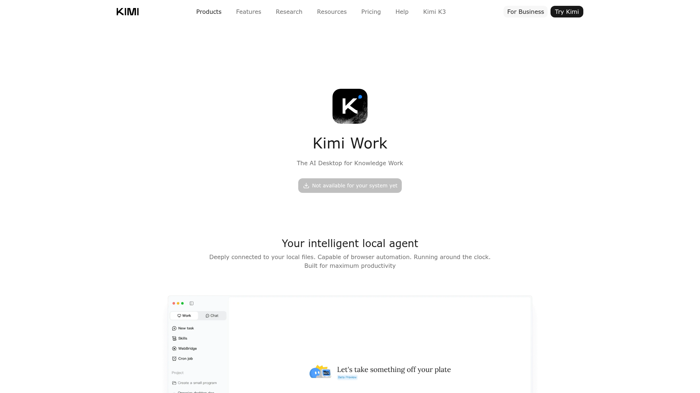

# DESIGN.md: Kimi Work hero reference

## Source

- URL: https://www.kimi.com/products/kimi-work
- Capture date: 2026-07-19
- Evidence: Firecrawl branding and image extraction, viewport screenshot, and inspected page markup and published animation bundle

## Reference Screenshot



Use the screenshot for the reference page's spacing and hierarchy. The animation itself is clearer in motion than in a single captured frame.

## Design Summary

The reference hero puts a restrained product message above a large, softly masked animated field. Its background is a WebGL canvas made from thousands of ASCII-like glyphs. The keepitmovin adaptation should preserve the calm depth and wide fade, but express continuous agent handoffs rather than reproduce Kimi's exact field.

## Design Tokens

### Colors

- Reference: white background, near-black text, blue accent.
- Adaptation: keep the existing dark-first `--bg`, `--text`, and orange `--accent` tokens.
- Motion stays low-contrast. Orange is reserved for occasional `»` handoff markers.

### Typography

- Reference: neutral system sans with a 40px hero heading.
- Adaptation: retain Instrument Sans for product copy and JetBrains Mono for animated glyphs and technical details.

### Spacing And Layout

- Reference hero: centered content, generous top and bottom space, animation spanning beyond the copy, and a vertical mask that fades the field out.
- Adaptation: keep the existing centered hero and terminal demo. Place the motion layer behind the full hero and protect headline legibility with a soft central vignette.

## Components

- `HeroFlow.astro`: decorative 2D canvas whose fixed grid cells morph among dots, slashes, chevrons, and sparse orange `»` markers.
- `HeroFlowEditor.astro`: query-gated live controls opened with `?hero-editor=true`, with browser-local persistence and versioned JSON export.
- Hero copy: one plain headline without vendor logos.
- Existing install control and terminal demo remain the functional focus.

## Motion And Interaction

- Keep every glyph anchored to a fixed grid position. Evolve its character, size, weight, and opacity to reveal two slow handoff ribbons.
- Pause the canvas when it leaves the viewport.
- Cap device-pixel ratio at 2 and particle count at 180.
- Render a static frame when `prefers-reduced-motion` is enabled.

## Agent Build Instructions

1. Keep the effect decorative and non-interactive.
2. Keep moving marks below copy contrast; the headline must remain readable first.
3. Use the existing design tokens so dark and light modes both work.
4. Do not use Kimi logos, imagery, copy, glyph atlas, or source animation code.
5. Prefer a lightweight Canvas 2D implementation over the reference page's WebGL pipeline.

## Rerun Inputs

```yaml
workflow: firecrawl-website-design-clone
source_url: https://www.kimi.com/products/kimi-work
target_stack: Astro and CSS
output: DESIGN.md and implemented hero treatment
```
